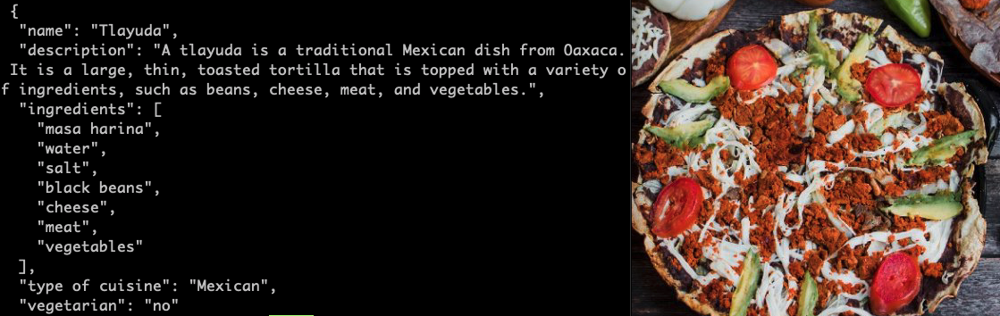
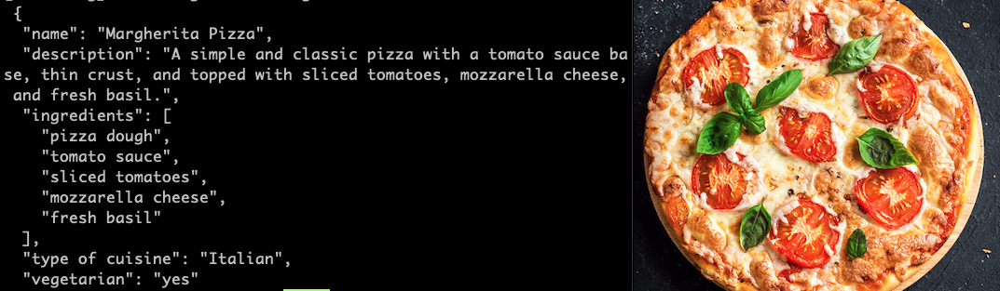

# Food Image Analysis powered by Google's Gemini AI model

Sample to analyze food images using [Google Generative AI models](https://cloud.google.com/vertex-ai/docs/generative-ai/multimodal/overview?_ga=2.14009527.-1884970597.1699585448), the API analyzes the image and returns the ingredients.

## Recipe API Rest

<table>
	<tr>
		<th>Method</th>
		<th>Endpoint</th>
		<th>Description</th>
	</tr>
	<tr>
		<td>POST</td>
		<td>/recipes</td> 
		<td>Analyze an Image URL </td>
	</tr>
</table>  

**Body**

```  
{
    "url_image": "https://www.elsoldemexico.com.mx/incoming/ayh193-img_8339.jpg/ALTERNATES/LANDSCAPE_768/IMG_8339.jpg"
} 
```



 
<table>
	<tr>
		<th>Method</th>
		<th>Endpoint</th>
		<th>Description</th>
	</tr>
	<tr>
		<td>GET</td>
		<td>/recipes</td> 
		<td>Analyze an image from local assets directory</td>
	</tr>
</table>  




## Run Local Environment
1. Create a new file ```.env```
2. Create a API key in new project [Google AI Studio](https://makersuite.google.com/app/apikey) 
3. Add a new variable ```API_KEY=XXXXX``` to the file ```.env```
4. [Install the gcloud CLI](https://cloud.google.com/sdk/docs/install)
5. ```go run cmd/*.go```
6. That's it!

Google Generative AI
--------------------------
[Google AI](https://ai.google/)
[Generative AI Overview](https://ai.google/discover/generativeai/)
[Introduction to Generative AI](https://www.cloudskillsboost.google/course_templates/536)
[Google AI for Developers](https://ai.google.dev/)
[Google AI Go SDK](https://github.com/google/generative-ai-go)
[Introducing Gemini](https://blog.google/technology/ai/google-gemini-ai/#sundar-note)
[Google AI versus Vertex AI differences](https://cloud.google.com/vertex-ai/docs/generative-ai/migrate/migrate-google-ai#google-ai)
[Go Genai](https://pkg.go.dev/github.com/google/generative-ai-go/genai#pkg-examples)
[Vertex AI](https://cloud.google.com/vertex-ai?hl=en)
[Duet AI](https://cloud.google.com/duet-ai?hl=en)
[Bard](https://bard.google.com/chat)


Do you want to contribute?
--------------------------

Feel free to report or add any useful feature, I will be glad to improve it with your help.

Developed By
------------

* Twitter X - [@ErikJhordan_Rey](https://twitter.com/ErikJhordan_Rey)

